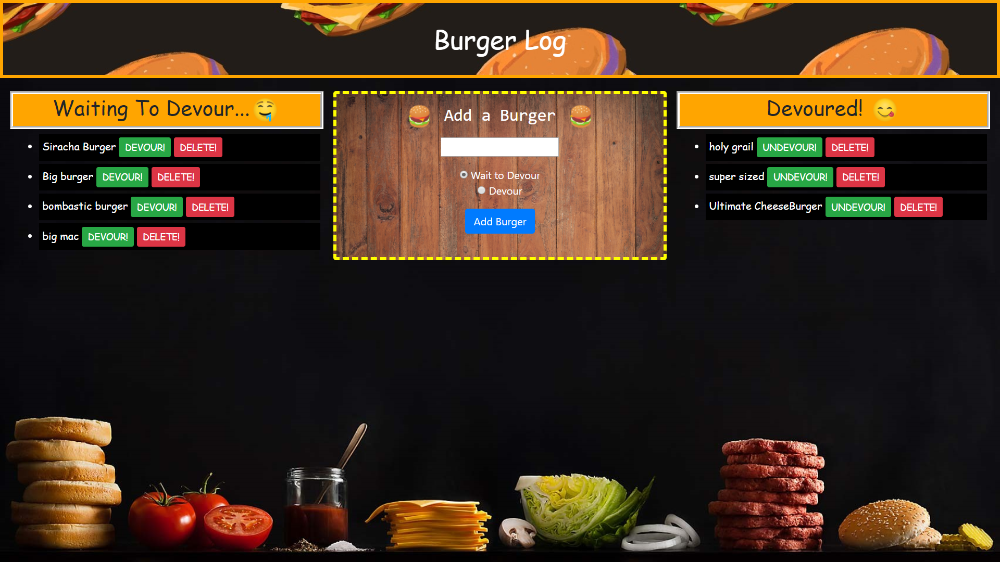

# Burger-Log
Node/Mysql Web app that lets you insert burger names into  two seperate lists which are: Waiting To Devour & Devoured.
There are also two buttons next to each name to delete & switch lists.
App listens to a connection such as local host and lets you add/view/delete burger names and saves the data so you can use and see the notes on different devices or platforms once deployed to the internet, like Heroku.

**How To Use:**

    1. Clone repository
    2. Run your terminal/CMD with the path set for cloned repository folder
    3. In the terminal, run the command: npm install (a new folder should appear in the repo named node_modules)
    4. Open connection.js in the config folder and enter in your mysql connection criteria such as your host, port, username(user), and password.
    5. Run the command: node server.js, it should return "App listening on PORT: 3000" or whatever port number you set.
    6. Open your internet browser and go to http://localhost:3000 or whatever port number you set.

___________________________________________________________________________________________________________________________________

The app is also deployed on Heroku here: https://theburgerlog.herokuapp.com/
___________________________________________________________________________________________________________________________________

